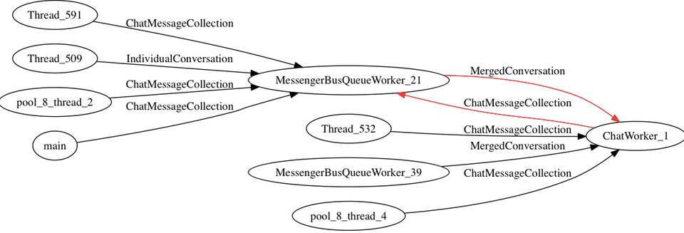
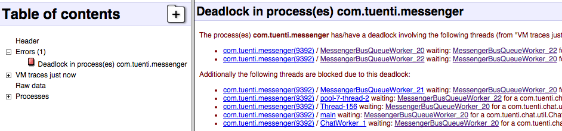

Ikusth
======

Threads dependency graph generator

Introduction
------------

Do you hate wasting time processing traces.txt file with your mind? Try Ikusth :)

This tool is a [ChkBugReport](https://github.com/sonyxperiadev/ChkBugReport) external plugin which allows you to generate a threads dependency graph given a **traces.txt** or bugreport file.

> Output example:

Usage
-----

### First

Install Graphviz (what we use to render the graph) if you don't have it:
``
e.g brew install graphviz
``

More info: [http://www.graphviz.org/Download.php](http://www.graphviz.org/Download.php)

### The easy way (just use the jars we provide in Ikusth repo dist folder)

* Clone Ikusth:
``
git clone https://github.com/sonyxperiadev/ChkBugReport.git
``

* From the repo folder, go to the **dist** folder:
``
cd dist
``

* Run against your traces.txt file:
``
java -jar ./chkbugreport-X-Y.jar -sn:traces.txt --browser
``

>Note:
traces.txt is the input traces file you've generated.
E.g doing
``
adb pull /data/anr/traces.txt
``
 after ANR

>Nice blog post about it: http://www.twisterrob.net/blog/2015/04/android-full-thread-dump.html

### The better way

* Clone ChkBugReport:
``
git clone https://github.com/sonyxperiadev/ChkBugReport.git
``

* Compile ChkBugReport:
``
cd ChkBugReport/core/ && sh createjar.sh
``

chkbugreport-X-Y.jar will be generated in ChkBugReport/core/, just copy it wherever you want.

* Clone Ikusth:

``
cd ..
``

``
git clone https://github.com/tuenti/ikusth.git
``

* Compile Ikusth:

``
cd ikusth
``

``
./gradlew build
``
      
ikusth-1.0.jar will be generated in ikusth/build/libs/, copy it to ~/.chkbugreport or "extplugins" dir relative to chkbugreport-X-Y.jar

* Run against your traces.txt file:
``
java -jar ./chkbugreport-X-Y.jar -sn:traces.txt --browser
``

### More about running it ###

``
java -jar ./chkbugreport-X-Y.jar -sn:traces.txt --browser
``

This way of running chkbugreport will open the browser with the report and the graph output image (generated by ikusth).
You can also see where the generated png is after this run output line:

``
Running (generate) plugin: com.tuenti.ikusth.Ikusth...
``

If your traces.txt has a deadlock apart from the [Ikusth generated graph](example/ikusth_outputsample.jpg) you should see in the generated html something like this:

> ChkBugReport has way more options, check its doc:

[https://github.com/sonyxperiadev/ChkBugReport/wiki/Quick-instructions
](Link URL)[https://github.com/sonyxperiadev/ChkBugReport/wiki/Command-line-options](Link URL)

> A video about ChkBugReport: https://www.youtube.com/watch?v=YNI9e3VEv4Y

FAQ
---

* Generated png is empty...

Probably your traces.txt has no dependant threads.

* I get this error...

``
Running (generate) plugin: com.tuenti.ikusth.Ikusth...
org.enoir.graphvizapi.exception.GraphException: java.io.IOException: Cannot run program "dot": error=2, No such file or directory
	at org.enoir.graphvizapi.Graphviz.get_img_stream(Graphviz.java:132)
	at org.enoir.graphvizapi.Graphviz.getGraphByteArray(Graphviz.java:58)
	at com.tuenti.ikusth.Ikusth.generate(Ikusth.java:72)
	at com.sonyericsson.chkbugreport.Module.runPlugins(Module.java:676)
	at com.sonyericsson.chkbugreport.Module.generate(Module.java:567)
	at com.sonyericsson.chkbugreport.Main.run(Main.java:232)
	at com.sonyericsson.chkbugreport.Main.main(Main.java:358)
``

Assure [Graphviz](http://www.graphviz.org/Download..php) is installed.

Credits & Contact
-----------------

`ikusth` was created by [Tuenti Technologies S.L.](http://github.com/tuenti)

You can follow Tuenti engineering team on Twitter [@tuentieng](http://twitter.com/tuentieng).

License
-------

`ikusth` is available under the GPL, Version 2.0. See LICENSE file
for more info.
